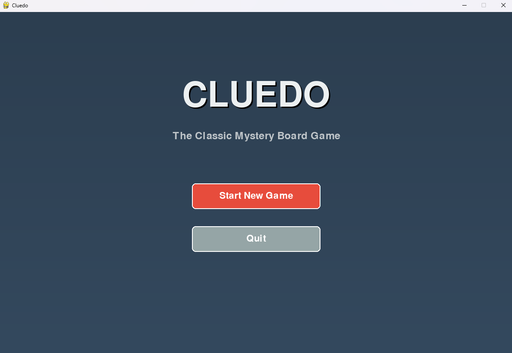
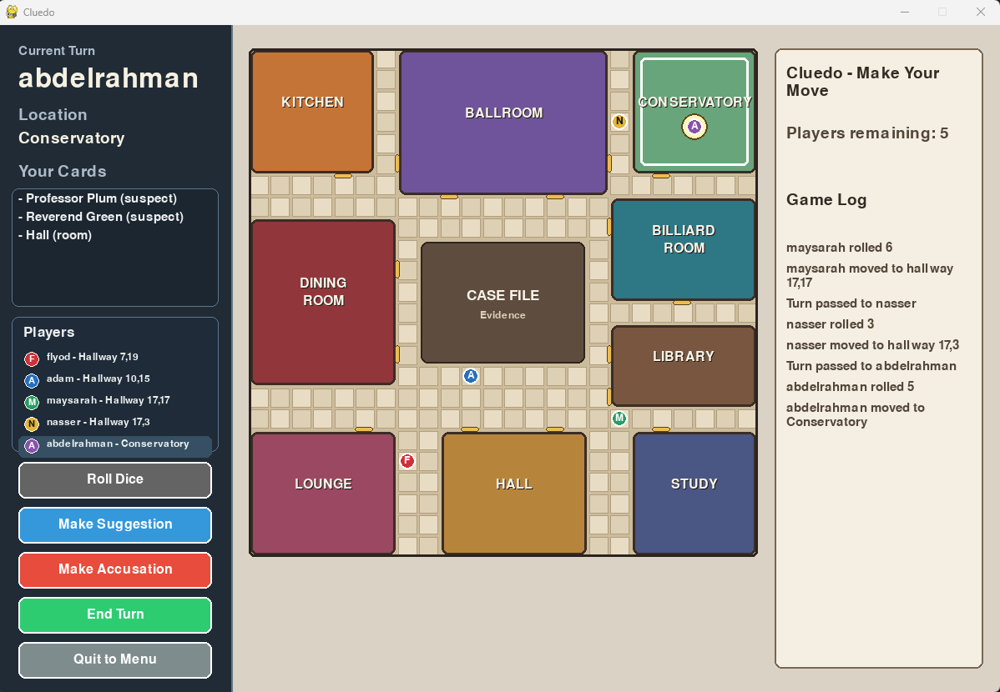
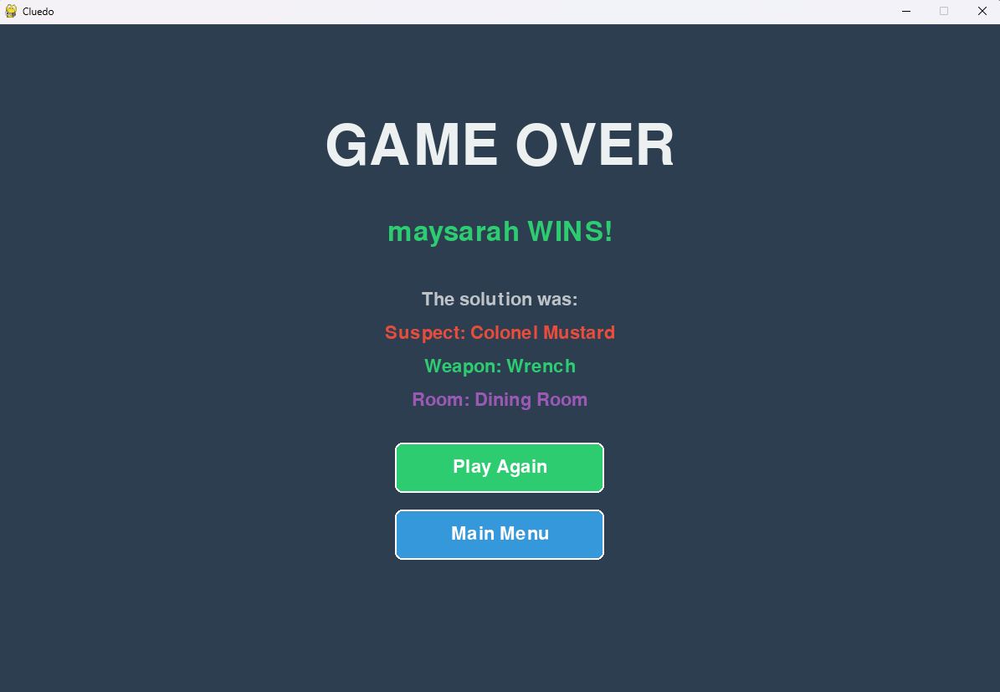

# Cluedo — Team 53

A Python + Pygame implementation of Watson Games' classic *Clue!* murder mystery board game. Built as a five-person Software Engineering coursework project at Sussex (G6046).

3–6 local human players take turns to deduce the murderer, the weapon, and the room. The game is hot-seat: one machine, one screen, players pass the device.

---

## Install

Requires Python 3.10 or later. Developed and tested on Python 3.13.

```bash
pip install -r requirements.txt
```

`requirements.txt` pins:

```
pygame==2.6.1
pytest==9.0.3
```

---

## Run

```bash
python -m src.main
```

(or equivalently `python src/main.py`)

Both invocations open the same Pygame window at 1200 × 800.

---

## Player setup

1. From the title screen, click **Start New Game**.
2. Enter between 3 and 6 player names. Empty and duplicate names are rejected with a visible error.
3. Click **Start Game** to deal the cards and begin.

The engine selects one suspect, one weapon, and one room as the hidden solution; the remaining 18 cards are dealt round-robin.

---

## Controls

The game is mouse-driven from start to finish.

| Action               | How                                                                                          |
| -------------------- | -------------------------------------------------------------------------------------------- |
| Move to a room       | Click **Move to Room** → pick a room from the dropdown → **Confirm**                          |
| Make a suggestion    | Click **Make Suggestion** (requires being in a room) → pick suspect + weapon → **Confirm**    |
| Make an accusation   | Click **Make Accusation** → pick suspect + weapon + room → **Confirm**                        |
| End your turn        | Click **End Turn**                                                                            |
| Quit                 | Close the window, or click **Quit** on the title screen                                        |

Suggestions and accusations validate inputs and surface clear errors (out of turn, eliminated, missing room) without crashing the game. When a suggestion is made, the suggested suspect and weapon tokens move into the suggester's current room and remain there afterwards (per F12 in the user requirements).

---

## Screenshots







---

## Run the tests

```bash
python -m pytest -q
```

The unit test suite covers engine setup, dealing, turn cycling, suggestion + refutation, accusation, validation, and edge cases. **Expected output: 100 passed.**

---

## Documentation

Process, design, testing, and reporting documentation lives under [`docs/`](./docs/). Start at [`docs/README.md`](./docs/README.md) for a marker-facing index of every deliverable.

Engineering decisions and deviations from the original user requirements are recorded as ADRs in [`docs/decisions.md`](./docs/decisions.md).

---

## Team 53

| Person       | Role                                              |
| ------------ | ------------------------------------------------- |
| Floyd        | Technical Lead & Integrator                       |
| Maysarah     | Game Logic Engineer                               |
| Adam         | Scrum Master, Documentation Lead & Product Owner   |
| Nasser       | UI/GUI Engineer                                   |
| Abdurrahman  | QA Lead                                           |
