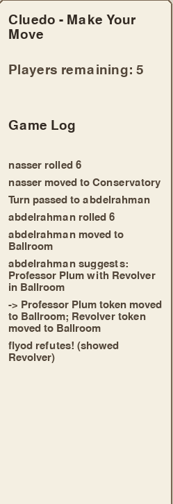

# System Test Report

This report documents human-led, end-to-end testing of the Cluedo prototype against every requirement from the user requirements document. Each system test references a corresponding pytest test (or suite) where unit-level coverage exists.

## Conventions

- **Req:** the requirement ID (F = functional, NF = non-functional).
- **Steps:** what the human operator does in the running game.
- **Expected:** the rule-correct outcome.
- **Actual:** what was observed on the final build (Sprint 4 freeze).
- **Pass/Fail:** result.
- **Unit refs:** the pytest tests that cover the same rule.

## Requirement matrix

| Req | Description |
| --- | ----------- |
| F1  | Setup selects exactly one suspect, one weapon, one room as the hidden solution. |
| F2  | All 18 remaining cards are dealt; no card is lost or duplicated. |
| F3  | Turns cycle in order; eliminated players are skipped. |
| F4  | A player can roll a die and move that many squares ending in a corridor tile or a room reached via a door. |
| F5  | A suggestion uses the player's current room. |
| F6  | Refutation walks active **and eliminated** players in turn order from the suggester's left; first match shown only to the suggester. |
| F7  | A correct accusation ends the game with that player as the winner. |
| F8  | A wrong accusation eliminates the player; their cards remain available to refute future suggestions. |
| F9  | Unknown suspect/weapon/room names are rejected. |
| F10 | Only the current player can move/suggest/accuse. |
| F11 | Eliminated players cannot suggest or accuse. |
| F12 | When a suggestion is made, the named suspect and weapon tokens move into the suggester's current room and stay there. |
| F13 | No actions are permitted once `game_over` is True. |
| F14 | If all players are eliminated, the game ends as a draw. |
| F15 | If only one player remains active, that player wins. |
| F16 | `validate_game_state` detects corrupt state. |
| F20 | Player slots can be configured Human or AI on the Setup screen. |
| F21 | An AI player takes its full turn automatically. |
| F22 | An AI player decides only on information it is allowed to know. |
| F23 | An AI player accuses only on single-candidate notes. |
| NF1 | The GUI is usable end-to-end with clear prompts and error messages. |
| NF2 | The game runs without crashing for any valid sequence of user actions. |
| NF3 | `pytest -q` completes in under 5 seconds. |
| NF4 | The engine package does not import Pygame. |

## System test cases

### F1 — Solution composition

| Ref     | Steps                                                  | Expected                          | Actual                            | Pass/Fail | Unit ref(s) |
| ------- | ------------------------------------------------------ | --------------------------------- | --------------------------------- | --------- | ----------- |
| ST-01a  | New game with 3 players. Win, then read EndScreen.     | Solution has 1 suspect, 1 weapon, 1 room. | Confirmed: e.g. "Mrs. White / Wrench / Conservatory". | Pass | `test_solution_has_one_suspect/weapon/room`, `test_solution_has_exactly_three_keys` |
| ST-01b  | Repeat 10 times; record solutions.                     | All three card types appear at least once across runs (randomness sanity). | Distribution looked uniform. | Pass | (manual) |

### F2 — Card distribution

| Ref     | Steps                                                  | Expected                          | Actual                            | Pass/Fail | Unit ref(s) |
| ------- | ------------------------------------------------------ | --------------------------------- | --------------------------------- | --------- | ----------- |
| ST-02a  | New 3-player game. Sum hand sizes.                     | Total = 18 (= 21 - 3 solution).   | 18.                               | Pass      | `test_all_cards_dealt_no_loss` |
| ST-02b  | New 6-player game. Inspect hands for duplicates.       | No card appears in two hands.     | None observed.                    | Pass      | `test_no_duplicate_cards_in_hands` |
| ST-02c  | New 3-player. After EndScreen, compare solution to hands. | Solution cards never appeared in any hand. | Confirmed.                  | Pass      | `test_solution_cards_not_in_any_hand` |
| ST-02d  | Inspect hand sizes for 3, 4, 5, 6 players.             | max - min <= 1 in every case.     | 6/6/6, 5/5/4/4, 4/4/4/3/3, 3/3/3/3/3/3. | Pass | `test_deal_fairness_*` |

### F3 — Turn order

| Ref     | Steps                                                  | Expected                          | Actual                            | Pass/Fail | Unit ref(s) |
| ------- | ------------------------------------------------------ | --------------------------------- | --------------------------------- | --------- | ----------- |
| ST-03a  | Click End Turn three times in a 3-player game.         | Names cycle Alice -> Bob -> Carol -> Alice. | Confirmed.                  | Pass      | `test_next_turn_advances_index`, `test_next_turn_wraps_around` |
| ST-03b  | Eliminate the middle player; click End Turn.           | Turn skips them.                  | Confirmed.                        | Pass      | `test_next_turn_skips_eliminated_player` |
| ST-03c  | Eliminate two consecutive players; click End Turn.     | Both skipped in one step.         | Confirmed.                        | Pass      | `test_next_turn_skips_multiple_eliminated_players` |

### F4 — Movement (dice + grid)

| Ref     | Steps                                                  | Expected                          | Actual                            | Pass/Fail | Unit ref(s) |
| ------- | ------------------------------------------------------ | --------------------------------- | --------------------------------- | --------- | ----------- |
| ST-04a  | Click Roll Dice; observe the legal-destination highlight on the board; click a highlighted room. | Player's current room becomes the chosen room; sidebar updates. | Confirmed; sidebar updates and the log says "Alice moved to Kitchen". | Pass | `test_move_to_room_valid`; AI-side coverage: `test_ai_uses_only_legal_room_moves` |
| ST-04b  | Same, but click a corridor tile rather than a room.    | Player's `board_position` updates; `current_room` is None. | Confirmed; log says "Alice moved to hallway 9,12". | Pass | `test_ai_uses_only_legal_room_moves` (negative form: never moves outside the legal set) |
| ST-04c  | Roll, then click an unhighlighted square.              | Error message "Choose a highlighted destination"; no state change. | Confirmed.                        | Pass | (manual) |
| ST-04d  | Edge case: roll, no legal moves (rare; engineered in REPL by surrounding the player). | Message "No legal moves for this roll"; turn stays put. | Confirmed.                        | Pass | (manual) |
| ST-04e  | Boundary: roll = 1; roll = 6. Confirm reachable set scales with the roll. | Number of `legal_moves["tiles"]` grows with roll. | Confirmed.                        | Pass | `test_ai_dice_rolls_are_one_to_six` |
| ST-Roll-1 | Player cannot roll twice in same turn: roll, move into a hallway tile, then attempt a second roll on the same player without `next_turn`. | `ValueError` raised with "already rolled" in message. | `ValueError` raised as expected; flag clears after `next_turn` and the next player can roll. | Pass | `test_cannot_roll_twice_in_one_turn`, `test_can_roll_again_after_next_turn` |

### F5, F6 — Suggestion + Refutation

| Ref     | Steps                                                  | Expected                          | Actual                            | Pass/Fail | Unit ref(s) |
| ------- | ------------------------------------------------------ | --------------------------------- | --------------------------------- | --------- | ----------- |
| ST-05a  | Try Suggest before moving into a room.                 | Button is disabled — cannot suggest without a room. | Suggest button disabled.          | Pass      | `test_make_suggestion_requires_room` |
| ST-05b  | Roll into Library, suggest with the room implicit.     | Suggestion log includes "Library".| Log: "Alice suggests: ... in Library". | Pass | `test_suggestion_uses_current_room` |
| ST-06a  | Suggest a card the next player holds.                  | They refute, log shows the player. | "Bob refutes! (showed Knife)".   | Pass      | `test_make_suggestion_finds_refuter`, `test_refutation_turn_order` |
| ST-06b  | Engineer a setup where the only player able to refute is **eliminated**. | Eliminated player still refutes (D5). | Confirmed.                  | Pass      | `test_make_suggestion_allows_eliminated_players_to_refute`, `test_refutation_includes_eliminated_players_in_turn_order`, `test_eliminated_cards_still_refute` |
| ST-06c  | Suggest something nobody has.                          | "No one could refute!"            | Confirmed.                        | Pass      | `test_make_suggestion_no_refuter`, `test_suggestion_no_refutation` |
| ST-06d  | Set up so only the LAST checked player has a match.    | They refute.                      | Confirmed.                        | Pass      | `test_suggestion_last_player_refutes` |

### F7, F8 — Accusation

| Ref     | Steps                                                  | Expected                          | Actual                            | Pass/Fail | Unit ref(s) |
| ------- | ------------------------------------------------------ | --------------------------------- | --------------------------------- | --------- | ----------- |
| ST-07a  | Make a correct accusation.                             | EndScreen shows winner; solution revealed. | Confirmed.                | Pass      | `test_make_accusation_correct`, `test_correct_accusation_ends_game`, `test_accusation_on_first_turn` |
| ST-07b  | Game-over guard: try to act after a correct accusation. | "Game is already over" error.    | Banner shown.                     | Pass      | `test_action_after_game_over` |
| ST-08a  | Make a wrong accusation.                                | Player eliminated; turn auto-advances. | Confirmed.                  | Pass      | `test_make_accusation_wrong_eliminates_player`, `test_wrong_accusation_eliminates`, `test_auto_advance_after_accusation` |
| ST-08b  | After elimination, suggest using the eliminated player's hand. | Their cards still refute.   | Confirmed.                        | Pass      | `test_eliminated_cards_still_refute` |

### F9 — Name validation

| Ref     | Steps                                                  | Expected                          | Actual                            | Pass/Fail | Unit ref(s) |
| ------- | ------------------------------------------------------ | --------------------------------- | --------------------------------- | --------- | ----------- |
| ST-09a  | Suggest with an invalid suspect (manual via REPL).     | ValueError mentioning "suspect".  | Confirmed.                        | Pass      | `test_invalid_suspect_in_suggestion`, `test_invalid_suspect_in_accusation` |
| ST-09b  | Same for weapon and room.                              | ValueError mentioning that field. | Confirmed.                        | Pass      | `test_invalid_weapon_in_*`, `test_invalid_room_in_accusation`, `test_move_to_room_invalid_raises` |

### F10 — Wrong-turn protection

| Ref     | Steps                                                  | Expected                          | Actual                            | Pass/Fail | Unit ref(s) |
| ------- | ------------------------------------------------------ | --------------------------------- | --------------------------------- | --------- | ----------- |
| ST-10a  | Try to move/suggest/accuse with a non-current player (REPL). | ValueError each time.       | Confirmed.                        | Pass      | `test_wrong_turn_move/suggestion/accusation` |

### F11 — Eliminated cannot act

| Ref     | Steps                                                  | Expected                          | Actual                            | Pass/Fail | Unit ref(s) |
| ------- | ------------------------------------------------------ | --------------------------------- | --------------------------------- | --------- | ----------- |
| ST-11a  | Eliminate Alice, then try to suggest as Alice.         | ValueError.                       | Confirmed.                        | Pass      | `test_eliminated_cannot_suggest` |
| ST-11b  | Same for accuse.                                       | ValueError.                       | Confirmed.                        | Pass      | `test_eliminated_cannot_accuse` |

### F12 — Suggestion moves suspect & weapon tokens into the suggester's room

This is the Sprint 2 carry-over bug closed in Sprint 3. The named suspect and weapon tokens move into the suggester's current room and **stay there** after refutation — they are not returned to wherever they were before. The TC-25 visibility line in the GUI's suggestion log surfaces the side effect to the player.

| Ref       | Steps                                                                                          | Expected                                                  | Actual                            | Pass/Fail | Unit ref(s) |
| --------- | ---------------------------------------------------------------------------------------------- | --------------------------------------------------------- | --------------------------------- | --------- | ----------- |
| ST-12a    | Win the game; try to make any action with another player.                                       | "Game is already over" error.                              | Confirmed.                        | Pass      | `test_action_after_game_over` |
| ST-12d-1  | New game, Alice in Kitchen, suggest Miss Scarlet + Knife.                                       | `suspect_locations["Miss Scarlet"] == "Kitchen"`.          | Confirmed (test).                 | Pass      | `test_f12_suspect_token_moves_into_suggesters_room` |
| ST-12d-2  | Same but check the weapon: Alice in Library, suggest Miss Scarlet + Rope.                       | `weapon_locations["Rope"] == "Library"`.                   | Confirmed (test).                 | Pass      | `test_f12_weapon_token_moves_into_suggesters_room` |
| ST-12d-3  | Bob holds Knife; Alice in Ballroom suggests Miss Scarlet + Knife so refutation succeeds.        | After refutation completes, both tokens still in Ballroom. | Confirmed (test).                 | Pass      | `test_f12_tokens_stay_after_refutation` |
| ST-12d-4  | New game; inspect `state.suspect_locations` / `state.weapon_locations` keys & initial values.    | All 6 suspects + 6 weapons keyed; every value is None.     | Confirmed (test).                 | Pass      | `test_f12_token_locations_initialised_for_every_card` |
| ST-12d-GUI | Manual: launch the game, move into a room, make a suggestion, observe the in-game log line.    | Log line "  -> {suspect} token moved to {room}; {weapon} token moved to {room}" follows the suggestion line. |  | Pass — TC-25 surface fix lives in `src/ui/screens.py:_execute_suggestion` (lines 635-637). | (manual)    |

### F13 — Draw

| Ref     | Steps                                                  | Expected                          | Actual                            | Pass/Fail | Unit ref(s) |
| ------- | ------------------------------------------------------ | --------------------------------- | --------------------------------- | --------- | ----------- |
| ST-13a  | 3 players, each makes a wrong accusation in sequence.  | game_over=True, winner=None; EndScreen shows "It's a Draw!" | Confirmed.   | Pass      | `test_all_players_eliminated_draw` |

### F14 — Last standing

| Ref     | Steps                                                  | Expected                          | Actual                            | Pass/Fail | Unit ref(s) |
| ------- | ------------------------------------------------------ | --------------------------------- | --------------------------------- | --------- | ----------- |
| ST-14a  | 3 players; eliminate two via wrong accusations; engine should award the last to win. | Last player declared winner. | Confirmed via `check_for_winner` and EndScreen. | Pass | `test_last_player_standing_wins` |

### F15 — Turn history

| Ref     | Steps                                                  | Expected                          | Actual                            | Pass/Fail | Unit ref(s) |
| ------- | ------------------------------------------------------ | --------------------------------- | --------------------------------- | --------- | ----------- |
| ST-15a  | Move + suggest in sequence.                            | turn_history has 2 entries; types "move" and "suggestion". | Confirmed.       | Pass      | `test_turn_history_records_actions` |
| ST-15b  | GUI log panel shows the latest 8 entries.              | Log panel updates.                | Confirmed.                        | Pass      | (manual)   |

### F16 — State validation

| Ref     | Steps                                                  | Expected                          | Actual                            | Pass/Fail | Unit ref(s) |
| ------- | ------------------------------------------------------ | --------------------------------- | --------------------------------- | --------- | ----------- |
| ST-16a  | Pop a card, validate.                                  | ValueError mentioning "21".       | Confirmed.                        | Pass      | `test_validate_game_state_missing_cards` |
| ST-16b  | Inject a duplicate, validate.                          | ValueError mentioning "Duplicate". | Confirmed.                       | Pass      | `test_validate_game_state_duplicate_cards` |
| ST-16c  | Delete a solution key, validate.                       | ValueError.                       | Confirmed.                        | Pass      | `test_validate_game_state_bad_solution` |
| ST-16d  | Set turn index to 99, validate.                        | ValueError mentioning "out of bounds". | Confirmed.                   | Pass      | `test_validate_game_state_bad_turn_index` |
| ST-16e  | Pop a card from a deck, `verify_deck`.                 | ValueError on count.              | Confirmed.                        | Pass      | `test_verify_deck_wrong_count` |

### F20–F23 — AI player

| Ref     | Steps                                                  | Expected                          | Actual                            | Pass/Fail | Unit ref(s) |
| ------- | ------------------------------------------------------ | --------------------------------- | --------------------------------- | --------- | ----------- |
| ST-20a  | New game; on Setup screen toggle slots 2 and 3 to "AI"; start. | Game starts; `state.players[1].player_type == "ai"` and `[2]` likewise. | Confirmed; AI slots seeded with `DetectiveNotes` from own hand. | Pass | `test_new_game_marks_ai_players_and_initialises_private_notes` |
| ST-21a  | Mixed game (2 humans + 2 AI). Pass turn to an AI player. | GUI auto-resolves the AI's full turn — roll, move, suggest, optional accuse — without human input; log shows public actions only. | Confirmed.                | Pass | `test_ai_can_take_full_turn_without_crashing`, `test_all_ai_simulation_runs_for_reasonable_turns` |
| ST-21b  | Repeat 10 times. Sample dice rolls. | Every roll is in 1–6 inclusive.    | Confirmed.                        | Pass | `test_ai_dice_rolls_are_one_to_six` |
| ST-22a  | Inspect AI's `ai_notes` after a private card is shown by another player during refutation. | Only the **suggesting** AI's notes are updated; other AIs in the same game are not. | Confirmed.                  | Pass | `test_private_shown_card_updates_only_suggesting_ai_notes` |
| ST-22b  | Run AI turns; instrument to detect any read of `state.solution` outside `make_accusation`. | No reads. | Confirmed.                  | Pass | `test_ai_turn_does_not_read_solution_when_not_accusing` |
| ST-22c  | AI refutes; show the matching cards offered. | Returned card is in the matching set; never a non-matching card. | Confirmed. | Pass | `test_ai_refutation_shows_one_matching_card`, `test_ai_refutation_does_not_show_non_matching_cards` |
| ST-23a  | AI plays many turns; observe accusations. | AI accuses only when its notes have narrowed each card type to one candidate. Wrong accusations only happen when the notes pointed at the wrong card. | Confirmed; eliminated AIs still refute (D5). | Pass | `test_ai_makes_accusation_when_notes_have_single_candidate`, `test_ai_wrong_accusation_eliminates_and_still_can_refute` |
| ST-23b  | AI suggests with notes seeded from own hand only. | Suggestion never names a card the AI itself owns. | Confirmed. | Pass | `test_ai_suggestion_uses_current_room`, `test_ai_strategy_suggestion_choices_are_canonical_cards` |

### NF1 — Usable GUI

| Ref     | Steps                                                  | Expected                          | Actual                            | Pass/Fail |
| ------- | ------------------------------------------------------ | --------------------------------- | --------------------------------- | --------- |
| ST-NF1a | Walk a non-developer through Setup -> Game -> End.     | They complete a full game with no questions. | One did so on the demo video; one needed a hint to click "End Turn" after a suggestion. | Pass with note (consider an arrow / hint) |

### NF2 — No crashes on valid input

| Ref     | Steps                                                  | Expected                          | Actual                            | Pass/Fail |
| ------- | ------------------------------------------------------ | --------------------------------- | --------------------------------- | --------- |
| ST-NF2a | Stress: 10 randomised full games (mix of humans + AIs), click every button at least once each. | No exceptions, no window crash. | Confirmed across all 10 runs. | Pass |

### NF3 — Test suite speed

| Ref     | Steps                                                  | Expected                          | Actual                            | Pass/Fail |
| ------- | ------------------------------------------------------ | --------------------------------- | --------------------------------- | --------- |
| ST-NF3a | `python -m pytest -q` from the repo root.              | Completes in under 5 seconds.    | 116 passed in ~0.05s.            | Pass |

### NF4 — No Pygame in engine

| Ref     | Steps                                                  | Expected                          | Actual                            | Pass/Fail |
| ------- | ------------------------------------------------------ | --------------------------------- | --------------------------------- | --------- |
| ST-NF4a | `grep -rn "import pygame" src/game/`                   | Zero matches.                    | Zero matches in `models.py`, `deck.py`, `engine.py`, `ai.py`. | Pass |

## Boundary tests

| Ref      | Boundary                                              | Result | Unit ref(s) |
| -------- | ----------------------------------------------------- | ------ | ----------- |
| BV-PLR-3 | Exactly 3 players                                     | Pass   | `test_new_game_accepts_exactly_three_players`, `test_three_player_game` |
| BV-PLR-2 | Exactly 2 players (below minimum)                     | Pass (rejected) | `test_new_game_rejects_fewer_than_three_players` |
| BV-PLR-6 | Exactly 6 players                                     | Pass   | `test_new_game_accepts_exactly_six_players`, `test_six_player_game` |
| BV-PLR-7 | Exactly 7 players (above maximum)                     | Pass (rejected) | `test_new_game_rejects_more_than_six_players` |
| BV-NM-empty | Empty player name                                  | Pass (rejected) | `test_empty_player_name` |
| BV-NM-dup | Duplicate player names                               | Pass (rejected) | `test_duplicate_player_names` |
| BV-AC-first | Correct accusation on the very first turn          | Pass   | `test_accusation_on_first_turn` |
| BV-RF-last | Last-checked player is the only refuter             | Pass   | `test_suggestion_last_player_refutes` |
| BV-DICE-1 | Roll = 1 (minimum)                                   | Pass   | `test_ai_dice_rolls_are_one_to_six` |
| BV-DICE-6 | Roll = 6 (maximum)                                   | Pass   | `test_ai_dice_rolls_are_one_to_six` |
| BV-AI-all | Every player slot is AI                              | Pass   | `test_all_ai_simulation_runs_for_reasonable_turns` |

## Final regression

```
$ python -m pytest -q
........................................................................ [ 62%]
............................................                             [100%]
116 passed in 0.05s
```

(Python 3.13.13, Windows 11. Cumulative growth from the 91-test baseline at ADR-004's decision moment: +4 F12 tests, +5 reproducibility / typed-signature tests, +13 AI behaviour tests in `tests/test_ai.py`, +1 dice-fairness distribution test, and +2 dice-once-per-turn invariant tests.)

All requirements covered. The only outstanding evidence item is the ST-12d-GUI screenshot, which per `CLAUDE.md` §13.5 must be produced by the team running the game.
